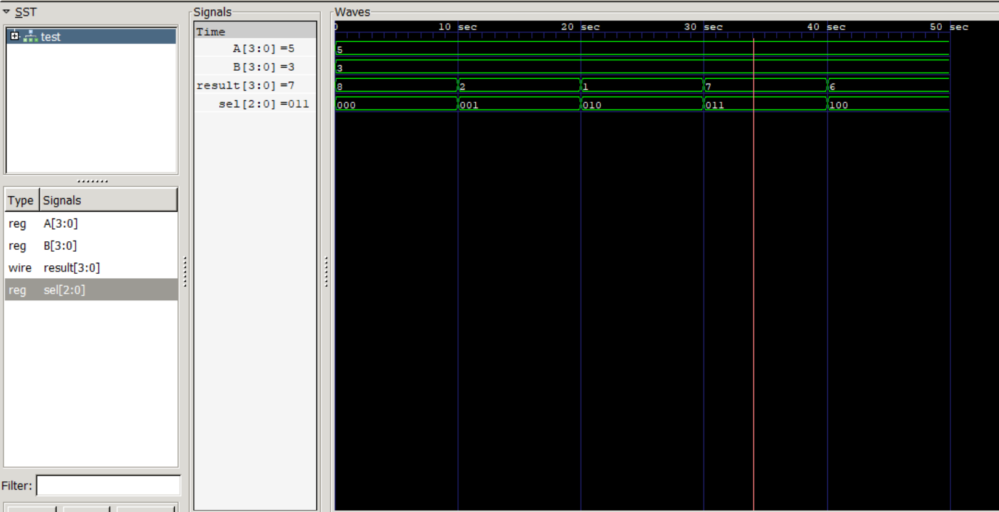
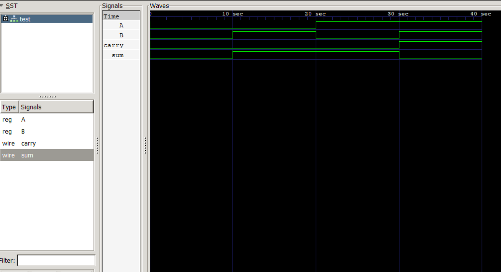
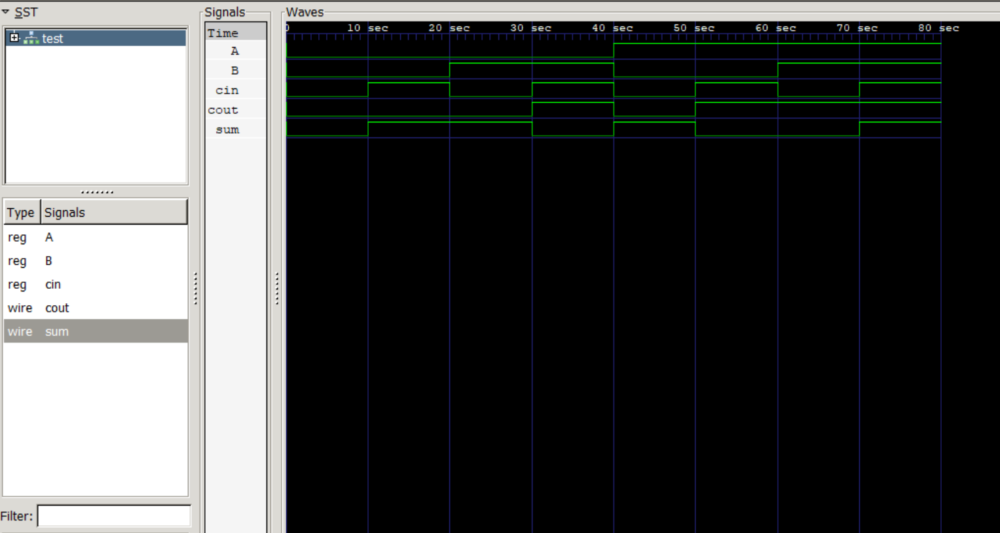
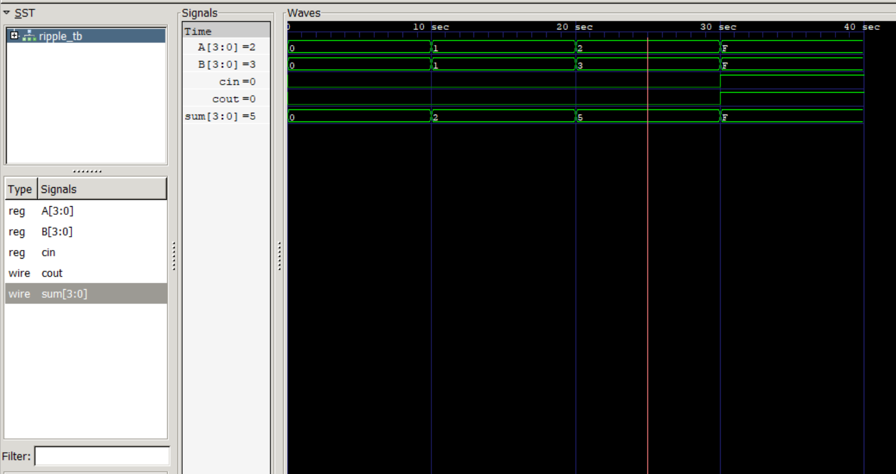

# 🔷 4-bit ALU using Verilog

## 📌 Description

This project implements a 4-bit Arithmetic Logic Unit (ALU) using Verilog HDL.
The ALU performs both arithmetic and logical operations based on a control signal and is verified using simulation waveforms.

---

## ⚙️ Operations Implemented

* Addition
* Subtraction
* AND
* OR
* XOR

---

## 💡 Working

The ALU operation is selected using a 3-bit control signal (`sel`):

| sel | Operation |
| --- | --------- |
| 000 | A + B     |
| 001 | A - B     |
| 010 | A & B     |
| 011 | A \| B     |
| 100 | A ^ B     |

---

## 🛠️ Tools Used

* Icarus Verilog
* GTKWave

---

## ▶️ How to Run

### 🔹 ALU

```bash
iverilog -o alu src/alu.v tb/alu_tb.v
vvp alu
gtkwave alu.vcd
```

---

### 🔹 Half Adder

```bash
iverilog -o ha src/half_adder.v tb/half_adder_tb.v
vvp ha
gtkwave half_adder.vcd
```

---

### 🔹 Full Adder

```bash
iverilog -o fa src/full_adder.v tb/full_adder_tb.v
vvp fa
gtkwave full_adder.vcd
```

---

### 🔹 Ripple Carry Adder (4-bit)

```bash
iverilog -o rca src/ripple_adder.v src/full_adder.v src/half_adder.v tb/ripple_tb.v
vvp rca
gtkwave rca.vcd
```

---

 ## 📷 ALU Waveform Output


## 📷 Half Adder Waveform Output


## 📷 Full Adder Waveform Output


## 📷 Ripple Adder Waveform Output


---

## 📁 Project Structure

* `src/` → Verilog design files
* `tb/` → Testbench files
* `docs/` → Waveform output

---
## ✅ Result
The Half Adder, Full Adder, and Ripple Carry Adder were successfully designed and verified using simulation waveforms.

The 4-bit ALU was implemented using these concepts and tested for multiple arithmetic and logical operations. All modules produced correct outputs as verified in GTKWave.

## 📌 Note
- The design follows a hierarchical approach:
  Half Adder → Full Adder → Ripple Carry Adder → ALU  
- Each module depends on lower-level modules  
- All dependent files must be compiled together during simulation  


